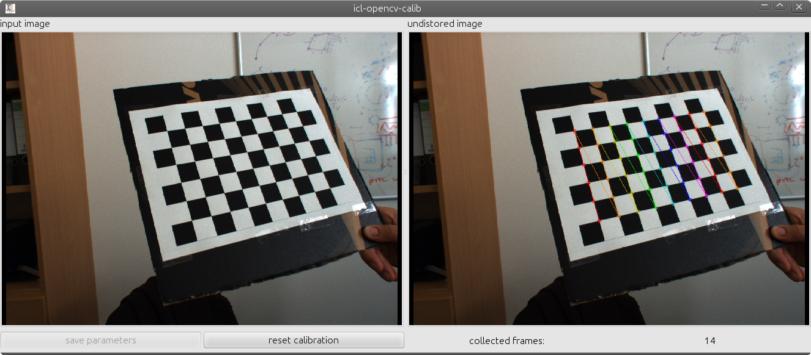

.. include:: ../js.rst

.. _howto.camcalib:

##################
Camera Calibration
##################

ICL provides a very intuitive tool for camera calibration. While
common tools, such as OpenCV's camera calibration tool or the Matlab
camera calibration tool-box, use a checker-board, that has to be
presented in many different orientation to the camera, ICL performs
camera calibration in a one shot manner. By using a 3D calibration
objects and by assuming lens-distortion correction to be performed
externally, accurate camera calibration can actually be performed in
real-time. Given a well described and accurately built calibration 
object, camera calibration is performed in less then one minute. 

In order to bypass detection issues, ICL's camera calibration tool
makes use of ICL's built-in fiducial marker detection toolbox. The
calibration object needs to be augmented with a set of fiducial
markers that can be detected with a high reliability and high
accuracy.

The calibration prodecure produces a camera description xml file,
which is used to instantiatiate the :icl:`geom::Camera` class. the
camera class is used for ICL's 3D computer vision tools located in the
:icl:`icl::geom` package. 

The calibration toolbox explicitly includes calibration of multi
camera environments. To this end, each camera can simply be calibrated
seperately, each resulting in a portable and human readable xml
description file. Since Kinect (consisting of a depth and color
camera) can basically also be seen as a stereo camera system, ICL
implicitly supports RGB-D calibration allowing to compute the mapping
between Kinects color and depth image (please note that usually
Kinects depth-camera is calibrated by exploiting the fact that Kinect
also allows to grab the camera intensity (IR) image. In contrast to
the depth image, the intensity images also allows fiducial markers to
be detected just like in common gray-scale or color images).

Table of Contents
"""""""""""""""""

* :ref:`howtos.calib.distortion`
* :ref:`howtos.calib.object`
* :ref:`howtos.calib.application`
* :ref:`howtos.calib.kinect`

.. _howtos.calib.distortion:

Image Undistortion (Lens distortion correction)
"""""""""""""""""""""""""""""""""""""""""""""""

ICL explicitly distinguishes between *camera calibration* and
*correction of lens distortion*. While camera calibration only builds
on projective geometry, lens distortion can only be modeled in a
non-linear manner leading to several issues in former processing
steps. Therefore, ICL explicitly assumes lens distortion to be
corrected **before** camera calibration is approached. Unfortunately,
ICL's support for lens distortion correction is not supported as
strong as it perhaps could be, which is due to the fact, that most
camera we used only showed an insignificant amount of lens distortion.

However, the ICL application **icl-opencv-calib**, located in the
**Geom** module provides the necessary functionality to obtain
appropriate parameters for lens distortion correction. Internally this
wraps OpenCV's calibration functions, but we plan to provide a native
built-in tool for lens distortion correction in the future. For
**icl-opencv-calib**, a common checkerboard image is needed. In order
to obtain optimal calibration results, the image of the checkerboard
must be printed out and attached to a very planar
surface. Alternatively, the images could also be displayed on another
computer screen, so that it is visible by the camera. 

.. note::

  The checkerboard dimensions, that need to be given to the program
  refer to the amount of inner checkerboard edges, so usually one less
  then the intuitive number of x and y cells.

In order to initiate the tool, just run it with an approriate parameter
set, e.g.::
  
  icl-opencv-calib -i dc800 0 -cbs 6x9 -m 20

This uses the first fire-wire device, a 6 by 9 checkerboard and a set
of 20 reference images for calibration. Here is a screenshot of the
application running:

Once, enough frames are collected the application will automatically
start the calibration procedure, resulting in the estimation of both
intrinsical camera parameters (focal length in x and y direction, and
principal point offset of the camera). However, it turned out, that
the estimation of these parameters is more accurate when using a 3D
calibration object, which is why these parameters are estimated and
also saved, but not used in the further steps of the processing
pipeline. By pressing the *save parmeters* button pops up a file
dialog, which allows the destimation xml file to be selected. The
resulting file looks like this one:

.. literalinclude:: files/udist.xml
    :language: xml

Once an undistortion parameter file is available (e.g. called
**udist.xml**), it can be passed to all ICL-applications that use the
:icl:`io::GenericGrabber` (see also :ref:`io.generic-grabber`) for
images acquistion. Usually ICL applications use the generic grabber in
combination with ICL's program argument evaluation toolkit (see also
:ref:`utils.pa` and/or :ref:`this code example<simple-example>`).
These applications most of the time provide an input argument **-input**
which allows two additional parameters to be passed e.g.::
  
  icl-viewer -input dc800 0

Here, the first *sub-argument* **dc800** selects a grabber backend,
which is fire-wire-800 in the present example, and the second
sub-argument selects a device from that backend (here, the 1st one
found -- at index 0). As explained :ref:`here<io.generic-grabber>`, the second
sub-argument can be augmented with additional parameters of shape
**@name=value** that are then passed to the underlying grabber
implementation. As a generic feature, all backends support the
parameter **@udist=udist-xml-file**, so using the created file
**udist.xml** with our **icl-viewer** application would work like::

  icl-viewer -input dc800 0@udist=./udist.xml

.. _howtos.calib.object:

The Calibration Object and its XML-based description
""""""""""""""""""""""""""""""""""""""""""""""""""""

TODO

.. _howtos.calib.application:

ICL's camera calibration application
""""""""""""""""""""""""""""""""""""

TODO

.. _howtos.calib.kinect:

Calibrating Kinect and Kinect-Like Devices
""""""""""""""""""""""""""""""""""""""""""

TODO

