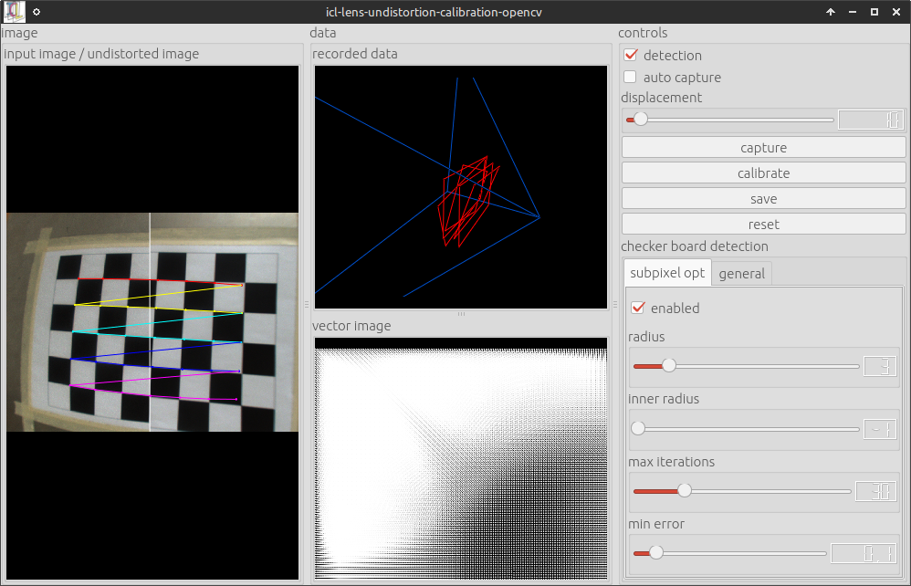
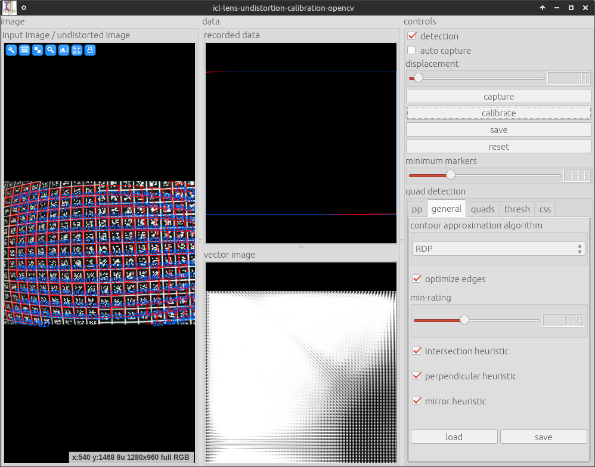
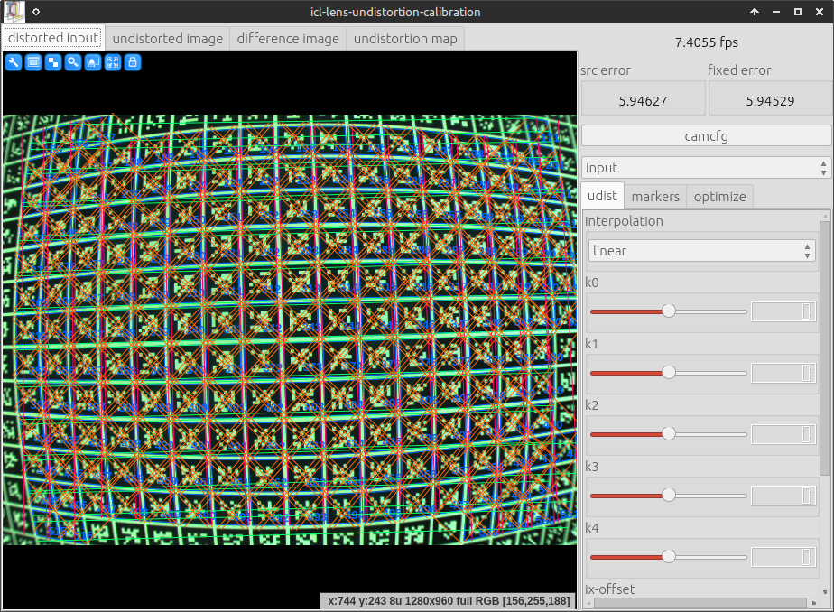
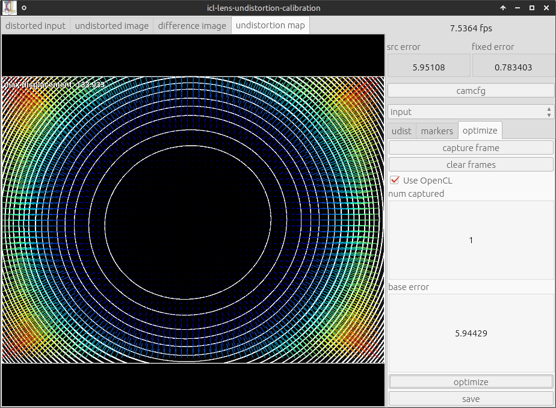
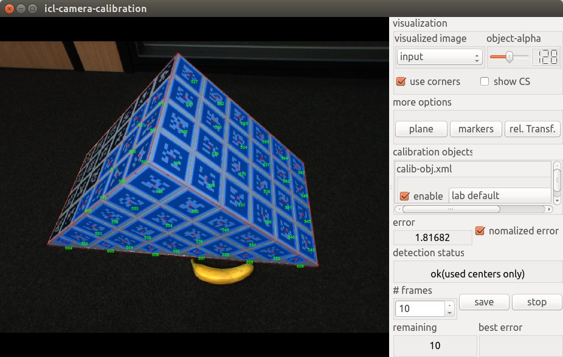

.. include:: ../js.rst

.. _howto.camcalib:

##################
Camera Calibration
##################

ICL provides a very intuitive tool for camera calibration. While
common tools, such as OpenCV's camera calibration tool or the Matlab
camera calibration tool-box, use a checker-board, that has to be
presented in many different orientation to the camera, ICL performs
camera calibration in a *one shot* manner. By using a 3D calibration
object and by assuming lens-distortion correction to be performed
independently (see below), accurate camera calibration can actually be
performed in real-time. Given a well described and accurately built
calibration object, camera calibration is performed in less then one
minute.

In order to bypass detection issues, ICL's camera calibration tool
makes use of ICL's built-in fiducial marker detection toolbox. The
calibration object needs to be augmented with a set of fiducial
markers that can be detected with a high reliability and high
accuracy.

The calibration prodecure produces a camera description xml file,
which is used to instantiatiate the :icl:`geom::Camera` class. The
camera class is used for ICL's 3D computer vision tools located in the
:icl:`icl::geom` package. 

The calibration toolbox implicitly includes calibration of multi
camera environments. To this end, each camera can simply be calibrated
seperately, each resulting in a portable and human readable xml
description file. Since Kinect (consisting of a depth and color
camera) can basically also be seen as a stereo camera system, ICL
implicitly supports RGB-D calibration allowing to compute the mapping
between Kinects color and depth image.

.. note:: 

  Usually Kinects depth-camera is calibrated by
  exploiting the fact that Kinect also allows to grab the camera's
  intensity (IR) image. In contrast to the depth image, the intensity
  images also allows fiducial markers to be detected just like in
  common gray-scale or color images.

Table of Contents
"""""""""""""""""

* :ref:`howtos.calib.distortion`
* :ref:`howtos.calib.object`
* :ref:`howtos.calib.application`
* :ref:`howtos.calib.kinect`

.. _howtos.calib.distortion:

Image Undistortion (Lens distortion correction)
"""""""""""""""""""""""""""""""""""""""""""""""

ICL explicitly distinguishes between *camera calibration* and
*correction of lens distortion*. While camera calibration only builds
on projective geometry, lens distortion can only be modeled in a
non-linear manner leading to several issues in former processing
steps. Therefore, ICL explicitly assumes lens distortion to be
corrected **before** camera calibration is approached.

The ICLCV module provides two different tools for the estimation of
lens-undistortion parameters:

* *icl-lens-undistortion-calibration (please do not use this!)*
* *icl-lens-undistortion-calibration-opencv*

While *icl-lens-undistortion-calibration-opencv* internally employs
OpenCV's calibration method, *icl-lens-undistortion-calibration* is 
implemented without OpenCV.

In contrast to OpenCV's built-in calibration application,
*icl-lens-undistortion-calibration-opencv* comes up with a set of
additional convenience features, such as automatic acquisition of
calibration frames and an option to replace the checkerboard-input
image by a fiducial-marker-based input grid.

*We initially had the impression that the OpenCV-based calibration
tool in some cases has a tendency to yield very bad results so we put
some effort into a standalone application. However, it later turned
out that the OpenCV tool actually works very well. The unsatisfying
results that we obtained were mainly caused by the misconception of
the to-be-used calibration pattern. When performing a google search
on "opencv calibration", one could come to the conclusion that a small
8 by 6 checkerboard pattern is most commonly used and therefore also
optimally suited. We, however, came to the conclusion that a much more
detailed pattern leads to much better results.*

OpenCV-based Lens Undistortion
~~~~~~~~~~~~~~~~~~~~~~~~~~~~~~

The ICL application **icl-lens-undistortion-calibration-opencv**,
located in the :ref:`cv` module provides the necessary functionality
to obtain appropriate parameters for lens distortion correction. For
the tool a common checkerboard image is needed. In order to obtain
optimal calibration results, the image of the checkerboard must be
printed out and attached to a very planar surface. Alternatively, the
images could also be displayed on another computer screen, so that it
is visible by the camera. The tool also allows a marker-grid image to
be used.

.. note::

  The checkerboard dimensions, that need to be given to the program
  refer to the amount of inner checkerboard edges, so usually one less
  then the intuitive number of x and y cells.

In order to initiate the tool, just run it with an approriate parameter
set, e.g.::
  
  icl-lens-undistortion-calibration-opencv -i dc800 0 -g 7x5

This uses the first fire-wire 800 device, a 7 by 5 checkerboard and a set
Here is a screenshot of the application running:

Once enough calibration frames were collected. The calibration can be
triggered. The collection of calibration frames can be triggered manually 
or an automatic mode can be activated. Here, the system would store every input
frame that has more than a minimum displacement (adjustable using the a slider)
all other already captured frames. OpenCV internally computes two sets of 
calibration prameters:

1. Parameters describing the projective camera geometry (focal length
   in x and y direction, and principal point offset of the camera, and
   skew -- which is always 0 here).

2. Parameters describing the compensation of lens distortion. Here, we use
   the standard model described by 5 scalar parameters k1, ..., k5

It turned out, that the estimation of the projective geometry
parameters is more accurate when using a 3D calibration object, which
is why these parameters are estimated and also saved, but not used in
the further steps of the processing pipeline. Pressing the *save*
button pops up a file dialog, which allows the destination
xml file to be selected. The resulting file looks like this one:

.. literalinclude:: files/udist.xml
    :language: xml

Once an undistortion parameter file is available (e.g. called
**udist.xml**), it can be passed to all ICL-applications that use the
:icl:`io::GenericGrabber` (see also :ref:`io.generic-grabber`) for
images acquistion. Usually ICL applications use the generic grabber in
combination with ICL's program argument evaluation toolkit (see also
:ref:`utils.pa` and/or :ref:`this code example<simple-example>`).
These applications most of the time provide an input argument **-input**
which allows two additional parameters to be passed e.g.::
  
  icl-viewer -input dc800 0

Here, the first *sub-argument* **dc800** selects a grabber backend,
which is fire-wire-800 in the given example, and the second
sub-argument selects a device from that backend (here, the 1st one
found -- at index 0). As explained :ref:`here<io.generic-grabber>`, the second
sub-argument can be augmented with additional parameters of shape
**@name=value** that are then passed to the underlying grabber
implementation. As a generic feature, all backends support the
parameter **@udist=udist-xml-file**, so using the created file
**udist.xml** with our **icl-viewer** application would work like::

  icl-viewer -input dc800 0@udist=./udist.xml

When using a camera with significant lens distortion, it is strongly
recommended to acquire undistortion parameters **before** approaching
the actual camera calibration step, since this assumes undistorted
images to be used as input.

**Marker-based Detection**

The checkerboard-input of the camera calibration tool has the severe
disadvantage, that input calibration frames can only be used if the
whole checker-board is visible. This, however, leads to the fact that
it is very difficult to provide calibration frames that also cover the
border regions of the images well. In order to make this step more
convenient, a marker-based grid can be used as well. Here, also a 
sub-set of marker-grid can be used for calibration. By calling::

  icl-lens-undistortion-calibration-opencv -i dc800 0 -m bch '[0-629]' 8x8 -g 30x21

The OpenCV-based camera calibration tool uses a 30x21 bch marker grid
as input. Here is a screenshot
  

As one can see, only a part of the marker-grid is visible and still the 
calibration can be performed very well. 

ICL's native Lens Undistortion Calibration Tool
~~~~~~~~~~~~~~~~~~~~~~~~~~~~~~~~~~~~~~~~~~~~~~~

**Please note, the work on this calibration tool was suspended. Please**
**Use icl-lens-undistortion-calibration-opencv instead**

ICL's camera calibration tool works quite similar to the OpenCV-based
tool, but it can only use marker-grid input. Appropriate marker-grid
images can be created using::

  icl-create-marker-grid-svg [...]

This allows grid parameters to be specified, such as the
grid-dimension, the size of markers and the gap between them. The results
is an SVG image that can then be converted into pdf or printed directly using
standard external tools such as inkscape. The calibration tool itself can 
be run using::
 
  icl-lens-undistortion-calibration -i dc800 0 -g 30x21

The user-interface differs a little bit from the OpenCV-based calibration
tool, but in general, it works very similar. Basically one should
make the grid visible in the camera and then go to the *optimize* tab on the 
right. Here, one can click *capture frame* for each to-be-captured input frame
and then *optimize* for the actual optimization. Please note that in particular, 
the OpenCL-based calibration mode is significantly faster -- albeit calibration 
still takes some seconds. Here are two screenshots of the tool:

  

.. _howtos.calib.object:

The Calibration Object and its XML-based description
""""""""""""""""""""""""""""""""""""""""""""""""""""

Before the actual camera calibration can be performed, a calibration
object needs to be constructed. The calibration object is then
augmented with fiducial markers that can be be detected robustly with
ICL's marker detection toolbox. It is very important to mention that
the calibration object needs to be a real 3D shape, e.g. the fiducial
markers must not be located on a coplanar surface only. It is
recommended to construct *something like a wooden angle with a 90
degree corner*, but all shapes, with known surface geometry are
possible. Once the Object is built, fiducial marker can be attached to
the object. Each fiducial marker will provide a image-to-world point
correspondence, needed for the calibration step, so the more markers
are used, the better the calibration result that can be obtained. As a
minimum 8 markers are needed, however, it needs to be taken into
account, that if only 8 markers are attached to the calibration
object, all markers must be detected. If more markers are used, the
calibration process will be faster and more accurate. Each marker that
is attached to the object later needs to be described geometrically
w.r.t. an arbitrary, but (for all markers) fixed calibration object
coordinate frame. For each 2D marker the following properties need to
be defined:

* marker size in mm
* marker offset to the object frame
* the fiducial marker type and ID

In order to facilitate the definition of a calibration object with
many markers, it is also possible to arrange sub-sets of the markers
in a regular 2D grid aligned coplanar in the object space. In this case,
the whole grid of markers can be described at once by:

* marker size is mm
* grid dimensions W x H
* offset of the upper left marker's center in object coordinates
* displacement vector between two marker centers in x-grid-direction
  (given in object coordinates)
* the same for the y-grid-direction
  
This allows a large set of marker to be defined at once. Markers
defined within a grid description also have a large advantages. Due to
the fact that they have a well defined x and y direction, the given
size information can be used to derive the object-coordinates of each
of the markers corners. This then allows the system to not only use
the marker center as a known object-to-world correspondence, but also
its four corners, resulting in a much higher key-point density. 

.. note::

  Also single markers can be defined as a 1 by 1 grid. In this case,
  only the normal direction of the given x and y displacement vectors
  are used to derive the object coordinates of the marker corners. By
  these means, the marker corners can also be used for markers that are
  not part of a larger grid

A single calibration object can consist of several grid definitions
and also several single marker definitions, that are then all used for
calibration.

In addition to the definition of markers attached to the calibration
object, a set of suggested object-to-world transforms can be
provided. Each suggested world transform can then later be selected
from a combo-box at run-time. For the typical triangularly shaped
calibration objects these suggestions usually provide an initial
rotation of the object so that it can be put standing upwards into the
scene. But also an offset between the object and the desired
world-frame can be defined here. Alternatively, the object-to-world
transform can also be defined interactively at run-time, but it is
recommended to do this only if the desired object-to-world transform
is not available. The GUI allows for printing the manually defined
object-to-world transform, so that it can be copy-and-pasted into the
calibration object file in case the calibration needs to be performed
again at a later point in time.

Last but not least, the calibration object definition file can contain
data that defines the geometry of the calibration object in .obj file
format. This is then read by the calibration application, which allows
to directly render the calibration object geometry using the
estimated/calibrated camera parameters as an image overlay in real-time.

.. note::

   Please note that the accuracy of the description/measurement of the marker layout
   is directly linked to the accuracy of the calibration result.

and 

.. note::

   Due to their outstanding accuracy, it is strongly recommended to
   use BCH code markers (see :ref:`markers.supported.bch`)
  

Calibration Object Examples 
'''''''''''''''''''''''''''' 
 
In order to provide a better understanding of what is mentioned here,
two examples are presented.

+----------------------------------------+----------------------------------------+
| .. image:: images/calib-obj-large.jpg  | .. image:: images/calib-obj-huge.jpg   |
|     :alt: shadow                       |     :alt: shadow                       |
|     :scale: 50%                        |     :scale: 50%                        |
+----------------------------------------+----------------------------------------+
| Our first calibration object. The      | Second calibration object example.     |
| object consists of two planks of wood  | The object was professionally designed |
| attached to each other in a 90 deg     | using CAD software and optimized with  |
| angle. The faces are 300 by 430 mm     | respect to several regards in          |
| (*banana for scale*)                   | comparison to our first design.        |
|                                        |                                        |
+----------------------------------------+----------------------------------------+

**First Example** (:download:`download xml file here<files/calib-obj-large.xml>`)

The calibration object description file uses ICLs config-file class
(see :icl:`ConfigFile` and :ref:`config-file-tutorial`), which uses a
special xml- based format. Due to its very regular shape, the object's
markers can well be described by 8 grids of markers -- two for each
face (The invisible back-faces are covered with markers as well).  The
reason why each face is not represented by a single grid is that the
markers were printed on A4 self-sticking labels that we were not
able to 100%ly align into a single regular grid of markers.

In the first sections, the marker layout is
presented. It is important to mention that the grids need to be
successively enumerated (**grid-0**, **grid-1**, ...). The marker IDs
can either be a continuous range [start,end] or a list of marker IDs
{a,b,c, ...}. The IDs are assumed to be distributed in row-major order
(row by row, from left to right) to the grid.

The following sections then define a set of suggested object- to-world
transforms. Each again successively enumerated. Each transform is also
given a unique name, that will later become a combo-box entry in the
calibration application's GUI. If no world transforms are given an
identity transform is automatically provided but if there are
suggested transforms, it is usually not the worst idea to also provide
an identity transform that then can manually be selected in the GUI.
                                                 
The last section contains the .obj file description for the object
geometry. Even though this is purely optional, it is strongly
recommended to use this feature, because it significantly facilitates
the manual evaluation of the current calibration results.

**Second Example** (:download:`download xml file here<files/calib-obj-huge.xml>`)
               
The most important difference is the much higher manufacturing
accuracy reached by a better design and material (PVC).

* by adding *the sides* of the object, strong angle deformations  
  are avoided                                                     
* an additional supporting bar at the otherwise open bottom side
  provides additional stability and shape accuracy and also works as a
  handle of the object
* the *fields* where the markers are attached are predefined by using
  high precision *flutes* added with a CNC milling cutter
* each marker is still attached manually, but not as part of a single
  A4 sheet of self-sticking paper. Instead, each marker was added
  separately. By these means, small errors in manually attaching the
  markers do not lead to *general drift* (when sticking a whole grid
  slightly rotated onto the object, all markers are wrong into the
  same direction), but small errors can be assumed to compensate each
  other mutatively.
                                                                                                          
The structure of the corresponding description file is comparable to
the first one, but it also demonstrates how to add single markers
and also the side faces are more complex to describe.

Since single markers do not provide a direction, they only provide a
single point 2D/3D point correspondence to the calibration
procedure. By defining the markers as a 1 by 1 marker grid, also a
direction can be given allowing to also use the 4 marker corners as
point correspondences.

While the square top faces result in large regular grids, the front
and back-face definition required a little hack. Rather than defining
the faces by many single markers, they were defined by a 5 by 5 marker
grid each, where the missing marker IDs are simply not used.

.. todo::

  add a helper application that can provide images of an artificial
  calibration object

.. note::                                                     
   
   the marker ID order is known to be a bit strange                

.. _howtos.calib.application:

ICL's camera calibration application
""""""""""""""""""""""""""""""""""""

Once a calibration object is available, it can be used for fast camera
calibration. The application we need for this is called
**icl-camera-calibration**. The application knows several input
arguments that will be presented in the following. A standard way to start
the application would look like this::

  icl-camera-calibration -i dc800 0 -c ./calib-obj.xml

This would start the calibration application acquiring images from the
first firewire 800 device using the calibration object described in
**./calib-obj.xml**.

.. note::

  In case of the need for a prior lens undistortion (see
  :ref:`howtos.calib.distortion`) the resulting parameter file (e.g. called
  **udist.xml**) would have to be passed to the fire-wire backend used by
  **icl-camera-calibration**. E.g::
  
    icl-camera-calibration -i dc800 0@udist=./udist.xml -c calib-obj.xml

However, for this tutorial, a single image (a png version of the one
shown above) of our more sophisticated calibration object is used. An
image can also be used as input by selecting the *file grabber* image
input backend::

  icl-camera-calibration -i file myImage.png -c calib-obj.xml
  
When the application starts, the resulting GUI looks like this

  
The GUI provides several features:

* **visualized image** here, you can select which image of the
  processing pipeline you want to see in the left images display
  component. Possible options are *input*, which shows the real input
  image, *pp*, which shows an intermediate image after the
  preprocessing step (usually gray) and *binary* which shows a binary
  version of the input image. The binary image is actually used
  internally for fiducial marker detection.

* **object-alpha** allows the transparency of the object's geometry
  overlay to be adapted. For a solid object visualization, the alpha
  value must be set to 255. 

  .. note:: 
  
    setting the alpha value to 0 allows for *looking through the
    object*, which is sometimes necessary to see a coordinate frame
    that occurs behind the virtual object. Due to the fact, that the
    used OpenGL does not support real transparency handling even a
    partly transparent object would not allow to see through it

* **use corners** defines whether to use marker corners or only marker
  centers. Actually, it is strongly recommended to always leave this
  checked. When internally solving the equations for camera
  calibration, using the corners sometimes lead to worse solutions --
  most of the time only when already enough marker centers are
  available. In this case the system will automatically not use the 
  corners internally

* **show CS** visualized the current world coordinate frame.
  If the object-to-world transform is *identity* this will be equal
  to the local calibration object coordinate frame

* **more options.plane** here, an artificial plane visualized as a 2D
  grid) can be added to the rendered scene overlay. An extra dialog
  that pops up allows the plane normal, the size and the color of the
  plane to be adapted. Once a plane is added, the mouse can be used to
  point at that plane in order to visualize the estimated 3D
  coordinate of the intersection between the plane and the view-ray
  estimated from the current camera calibration result and the mouse
  pointer. This feature becomes very handy when trying to estimate the
  real quality of the calibration result. You can e.g. measure a real
  distance or a known key point in the world and then point at that
  point in order to directly see the point's estimated 3D position,
  which should in an optimal case be identical to the known 3D
  position.
   

  .. image:: images/calib-2.jpg 
     :alt: shadow

  The image shows an example of a grid, visualized as an overlay of the
  *pp* image.

* **more options.markers** This is actually the most complex and
  sometimes also important set of properties that can be adjusted. The
  extra GUI that pops up allows for setting all properties necessary
  for the marker detection. Usually, these parameters are adapted
  after switching the the *binary* image. The most common parameters
  that have to be manually tuned here are the ones in the
  *thresh* tab, which define the mask size and the global threshold
  for the used :icl:`filter::LocalThresholdOp` instance. By adapting these
  parameters, it usually becomes possible to detect more markers, which 
  then directly improves the calibration result.

  .. note:: 

      It is not the worst idea to optimize your calibration outcome by
      trying to find the parameter set that leads to a maximum number
      of detected markers. In contrast, tuning the parameters in order to
      make the **error** become as small as possible does not really make
      sense. For the calibration result, it is very important that

      1. as many markers as possible are detected
      2. the detected markers are well distributed over at least two
         non-coplanar surfaces of the calibration object
      3. the markers of the detected object cover a large part of the
         actual 2D image (optimally > 80%) and optimall reach into
         the corners of the image

* **more options.rel. Transf** shows an extra GUI that allows an
  additional object-to-world transform to be adapted. This is also the
  tool of your choice to add object-to-world transforms to the object
  description file. You can either start with an already defined
  transform (by selecting this in the combo-box below) or you can
  start with the identity transform. If we call this **T1**, the
  relative transform **TR** will also be pre-multiplied to get the
  actually used transform (**TR T1**) that defines the
  world-coordinates of the object's reference points. Once an
  appropriate transform is defined, the pop-up GUI allows for printing
  the current transforms (both, **TR** and **TR T1**), which can then
  be copy-and-pasted into the object description file and once it is
  endowed with an appropriate name, it can be selected in the
  transform selection combo box.

  .. note::
  
     for this, the application has to be restarted

* **calibration objects** Here, it becomes clear, that the application
  can actuall handle an arbitrary number of calibration objects at
  once (simply pass several calibration object files at once to the
  **-c** program arguments, but ensure that the used marker sets do
  not overlap to avoid random behaviour). When each of the calibration
  objects is a set up with an appropriate (and compatible transform),
  the union of all reference points it used for calibration.

  .. note::
  
    please ensure that the actual relative transform between different
    calibration objects use is well defined, since little relative
    displacements will significantly decrease the calibration 
    quality

  For each selected calibration object (checkbox checked, a predefined
  object-to-world transfrorm can be defined.

* **error and detection status** This simply shows an average object 
  detection error. The error is given by the square error of references points
  (in image space) and their virtual camera projects when using the currently
  estimated camera parameters. Normalizing the error* will normalize this value
  by to the number of actually found markers -- otherwise, less detected markers
  would result in a smaller errro.

Saving the calibration Result
'''''''''''''''''''''''''''''

Once an appropriate calibration result is obtained, the resulting
camera description can be saved using the **save** button. This will
raise a file-dialog for selecting an output **.xml** file. When
starting **icl-camera-calibration** with the program argument **-o
/tmp/myCalib.xml**, the file dialog is suppressed and the passed
output file is used

.. note::

  When using **-o filename**, the system will not ask before overwriting 
  files.

How can the result be used ?
''''''''''''''''''''''''''''

The resulting XML file can be used in combination with the
:ref:`ICLGeom<geom>` module. There are basically two main purposes for
the :icl:`geom::Camera`: visualization and 3D-vision. As for
visualization, the Camera class, which can be instantiated from a
given calibration result **.xml** file, is directly linked to ICL's 
:ref:`Scene Graph Framework<geom.scene-graph>`. The main goal here was to
provide a very simple way to 

* calibrate a real camera device **C**
* obtain the calibration result
* use the calibration result as a *virtual camera*
* create a *virtual scene*
* add the virtual camera to the virtual scene
* add virtual objects
* render the virtual scene on top of an image stream acquired from **C**
 
In this case, virtual and real objects should perfectly overlap if
they are located at the same position (the real object in the real
world, and the virtual object in the virtual world). ICL's
visualization framework provides exactly this in a very intuitive
manner at it even allows for zooming and panning of the view while
preserving the images' aspect ratio.

Please also see :ref:`geom.overlay`.

.. _howtos.calib.kinect:

Calibrating Kinect and Kinect-Like Devices
""""""""""""""""""""""""""""""""""""""""""

When using the Microsoft Kinect Camera, or other comparable devices,
that consist of a depth and a color camera, an important feature is
RGB-D calibration, which means to calibrate the used Color and Depth
camera. The actual issue is the determination of the parameters, that
provide the pixel-location of a given depth image pixel in the
corresponding color image. Since the cameras' view axes are not
identical, a small non-static offset between the the two image spaces
exists.

+-----------------------------------------------+--------------------------------------------------------------------------+
| .. image:: images/kinect-pc-uncalibrated.jpg  | PointCloud visualization extracted from                                  |
|   :alt: shadow                                | an uncalibrated kinect device. If you have                               |
|                                               | a kinect attached to your computer, you can                              |
|                                               | generate such a visualization e.g. with::                                |
|                                               |                                                                          |
|                                               |   icl-point-cloud-viewer -pci dcam kinectd,0,DEFAULT,kinectc,0,DEFAULT   |
|                                               |                                                                          |
|                                               | As one can see, the color mapping is not correct. This becomes           |
|                                               | very obvious for the part with the human hand.                           |
|                                               |                                                                          |
+-----------------------------------------------+--------------------------------------------------------------------------+

Step by step RGB-D calibration of a Kinect device
'''''''''''''''''''''''''''''''''''''''''''''''''

The mapping between the two cameras can easily be estimated by simply
calibrating both kinect cameras separately in two calibration steps --
one for each camera. For this is is very **important** to not move the
camera or the calibration object between the two calibration steps.

1. Calibrate the color camera (using the calibration object
   description file, which is here located in the current directory)::

     icl-camera-calibration -input kinectc 0 -c calib-obj-huge.xml -o color.xml

   .. image:: images/kinect-calib-color.jpg
      :alt: shadow
      :scale: 60%
  
   The result is the xml-file **color.xml** which describes the
   parameters of the kinect color camera. If you are only interested
   in the mapping between color and depth camera, the actually used
   *object-to-world* transform is completely irrelevant, but is must
   of course be identical in the two calibration steps

2. Calibrate the depth camera. This step is actually a bit more
   tricky, since the markers on the calibration object can not be
   detected in the depth image. However, since it is known, that the
   depth image is computed on the basis of the *IR-intensity image*,
   which can also be accessed from the kinect camera, this is still
   possible. The only drawback, when calibrating on the basis of the
   intensity image, is that the actively emitted *IR speckle pattern*
   makes marker detection more difficult and potentially less
   accurate. While this effect becomes negligible in case of using a
   large calibration object with large markers (Due to the minimal
   viewing distance of kinect of about 70cm, smaller objects with
   smaller markers cannot simply be placed closer to the camera),
   smaller markers can quickly become undetectable by the system::

     icl-camera-calibration -input kinecti 0 -c calib-obj-huge.xml -o depth.xml
    
   .. image:: images/kinect-calib-intensity.jpg
      :alt: shadow
      :scale: 60%

   As one can see, smaller markers are detected much worse in the noisy
   intensity images.

   .. note:: 

      The speckle pattern can sometimes be too strong for robust
      marker detection. In this case, adapting the marker detection
      parameters can lead to acceptable results. In addition, we found
      out, that temporarily covering the Kinect's IR-speckle pattern
      emitter with one or even two layers of transparent plastic foil
      (e.g. from a transparent bag or a clear plastic folder) diffuses
      the emitted speckle pattern significantly. This can help to
      strongly increase the marker detection result, which, in turn,
      also improves the calibration result.

  
+-----------------------------------------------+----------------------------------------------------------------------------+
| .. image:: images/kinect-pc-calibrated.jpg    | Once the two calibration files (here, **depth.xml** and **color.xml**)     |
|   :alt: shadow                                | are available, the :icl:`geom::GenericPointCloudGrabber` that is           |
|                                               | recommended to be used for point cloud input can be set up to use the      |
|                                               | calibration result.  As an example, we can again use the                   |
|                                               | **icl-point-cloud-viewer** application, which was already used before to   |
|                                               | visualize the erroneous RGB-D calibration::                                |
|                                               |                                                                            |
|                                               |   icl-point-cloud-viewer -pci dcam kinectd,0,depth.xml,kinectc,0,color.xml |
|                                               |                                                                            |
|                                               | As one can see, the color and the depth images are now impressingly well   |
|                                               | alligned.                                                                  |
|                                               |                                                                            |
|                                               | .. note::                                                                  |
|                                               |                                                                            |
|                                               |   Please keep in mind, that perfect aligment/mapping from color to depth   |
|                                               |   image is not always possible. In case of having more than one *object    |
|                                               |   layer*, the coloring of the back layers/background cannot be 100%        |
|                                               |   perfect, since the color of object parts that are visible by the depth   |
|                                               |   camera, but occluded in the color camera image will be taken from the    |
|                                               |   object that *occludes* the other one                                     |
|                                               |                                                                            |
+-----------------------------------------------+----------------------------------------------------------------------------+
       
Calibrating Kinect with lower Resolution
''''''''''''''''''''''''''''''''''''''''

In many applications, the Kinect's depth images is not used in its
maximum resolution (VGA), but only in QVGA resolution (320 by
240). This is due to the fact, that the additional amount of pixels (4
times as many) when using full VGA resolution does not scale well to
the additional amount of information obtained when using VGA rather
than QVGA. Due to the method that is used to computed Kinect's depth
image, many sources argue that Kinect internally does not support more
than QVGA resolution and the VGA image is basically and intelligently
up-scaled version of this. Only by reducing the resolution to QVGA, many
point cloud processing applications obtain real-time capabilities. 

However, using ICL's calibration pipeline sketched above for Kinect
with QVGA resolution usually leads to difficulties when calibrating
the depth camera from the QVGA-intensity images. Here, often the
visible speckle pattern becomes too strong leading to an impossible or
very inaccurate calibration. In order to avoid these issues, the
camera calibration application provides an option to calibrate a
camera with a higher images size and then to internally artificially
downscale the resulting calibrated camera's resolution to a given
one. In case of the kinect camera, this could be done with::
  

  icl-camera-calibration -input kinectc 0 -c calib-obj-huge.xml -o color.xml -os QVGA
  icl-camera-calibration -input kinecti 0 -c calib-obj-huge.xml -o depth.xml -os QVGA

The given output-size (arg **-os**) is then used for the resulting camera
parameter **.xml** file. This feature can of course also be used for normal cameras.

.. note::

   This only leads to useful results, if the used camera images the
   one of larger resolution that is used for calibration and the one
   with the smaller target resolution are actually down-scaled
   versions of each other. If a camera (e.g. the Point Grey Flea2G)
   uses only a part of the full image when the image size is adapted,
   the calibration does not work with the **-os** argument.
