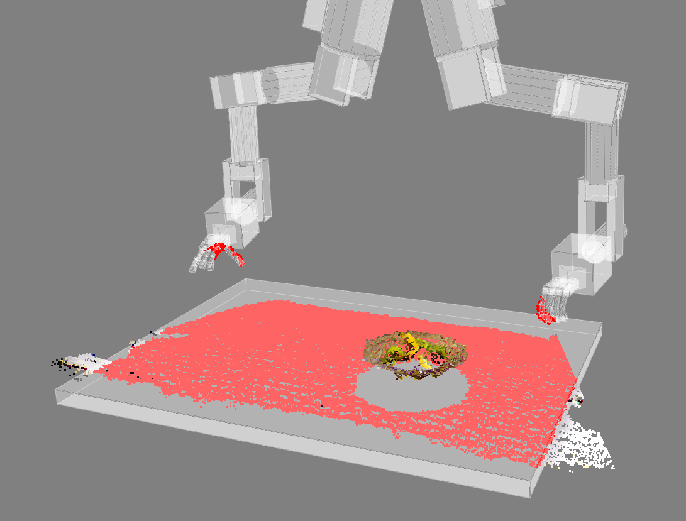

.. include:: ../js.rst

.. _pointcloud-filtering:

###############################
Point Cloud Primitive Filtering
###############################

Filtering a point cloud means removing or marking certain points specified by a set of rules.
In ICL, you can filter point clouds by geometric primitives such as cubes, spheres or cylinders.
The main class used for 3D point cloud primitive filtering is the :icl:`Primitive3DFilter` class.

Configuring a filter in XML
***************************

We will describe how you can declare primitives later.
For now, assume you have a set of geometric primitives that you want to use for point cloud filtering.
Then, you are able to configure the actual filter in an XML-based configuration file which you pass to the filter constructor.

.. code-block:: c++

	Primitive3DFilter filter(Primitive3DFilter::FilterConfig("config.xml"));

In the config file, the primitives are grouped (*primitivegroup* tag) according to a regular expression that should match the primitive *description* (see below).
In a robotic scenario, e.g., all primitives of the left robotic arm or all primitives describing the workspace could be grouped together.
These groups must be disjoint (mutually exclusive), i.e., a primitive can not be part of two groups at the same time. The number of groups is currently limited to eight. Primitive groups can have an optional *padding* attribute.
The *remove/setpos/color/label/intensity* tags describe which points are removed/marked. Keep in mind that actually removing points makes organized point clouds unorganized.
The *filterdepthimg* tag can be used to filter depth images.

* **Union:** The union of all groups within a *remove/setpos/color/label/intensity* tag is removed/marked.

* **Intersection:** Intersections of groups can be defined one level below these unions.

* **Negation:** You can specify if you want to remove/mark the inner or outer part of the primitives.

Thus, you configure the filter in **Disjunctive Normal Form**.

.. code-block:: xml

	<pointcloudfilter>
	    <primitivegroup id="" regex="" />
	    <primitivegroup id="" regex="" padding="" />
	    ...
	    <remove>
		<group  id="" part="inner|outer" />
		<intersection>
		    <group id="" part="inner|outer" />
		    ...
		</intersection>
		...
	    </remove>
	    <setpos x="" y="" z="">
		<group  id="" part="inner|outer" />
		<intersection>
		    <group id="" part="inner|outer" />
		    ...
		</intersection>
		...
	    </setpos>
	    <color r="" g="" b="" a="">
		<group  id="" part="inner|outer" />
		<intersection>
		    <group id="" part="inner|outer" />
		    ...
		</intersection>
		...
	    </color>
	    <label value="">
		<group  id="" part="inner|outer" />
		<intersection>
		    <group id="" part="inner|outer" />
		    ...
		</intersection>
		...
	    </label>
	    <intensity value="">
		<group  id="" part="inner|outer" />
		<intersection>
		    <group id="" part="inner|outer" />
		    ...
		</intersection>
		...
	    </intensity>
	    <filterdepthimg value="">
		<group  id="" part="inner|outer" />
		<intersection>
		    <group id="" part="inner|outer" />
		    ...
		</intersection>
		...
	    </filterdepthimg>
	</pointcloudfilter>

Declaring primitives
********************

A geometric primitive is represented as a **Primitive3DFilter::Primitive3D** object through a type, position, orientation, scale, and a *description* string that can be used for grouping in the config file.
You may want to have a look at the **point-cloud-primitive-filter** example application. Also, if you use `RSB <https://code.cor-lab.org/projects/rsb/>`_ and `RST <https://code.cor-lab.org/projects/rst/>`_,
you may want to generate the primitive set in an external application and make use of the following RST message definitions for sending the data over RSB.

A set of primitives:

.. code-block:: none

	package rst.geometry;

	option java_outer_classname = "Primitive3DFloatSetType";

	import "rst/geometry/Primitive3DFloat.proto";

	message Primitive3DFloatSet {

	    repeated Primitive3DFloat primitives = 1;

	}

A geometric primitive:

.. code-block:: none

	package rst.geometry;

	option java_outer_classname = "Primitive3DFloatType";

	import "rst/math/Vec3DFloat.proto";
	import "rst/geometry/Pose.proto";
	import "rst/timing/Timestamp.proto";

	message Primitive3DFloat {

	    enum PrimitiveType {
		CUBE = 0;
		SPHERE = 1;
		CYLINDER = 2;
	    }

	    required PrimitiveType type = 1;
	    required Pose pose = 2;
	    required math.Vec3DFloat scale = 3;
	    required timing.Timestamp timestamp = 4;
	    optional string description = 5;

	}

Applying the filter
*******************

Now, you are able to apply the filter to the point cloud.

.. code-block:: c++

	PointCloudObject obj;
	std::vector<Primitive3DFilter::Primitive3D> primitives;
	...
	filter.apply(primitives, obj);
