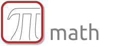
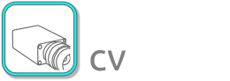

####################################
Image Component Library (ICL) Manual
####################################

.. |A| image:: icons/92px/utils.png
       :target: modules/utils.html
      

.. |C| image:: icons/92px/core.png
       :target: modules/core.html

.. |D| image:: icons/92px/filter.png
       :target: modules/filter.html

.. |E| image:: icons/92px/io.png
       :target: modules/io.html

.. |H| image:: icons/92px/geom.png
       :target: modules/geom.html

.. |I| image:: icons/92px/markers.png
       :target: modules/markers.html

.. |TT| image:: icons/tooltip.png
.. |ITT| image:: icons/index-tip.png

.. |H1| image:: icons/h1.png

.. |H2| image:: icons/h2.png

.. |H3| image:: icons/h3.png

.. |H4| image:: icons/h4.png

.. we force the 3 column layout here!

**Modules**

  | |A| |B| |C|
  | |D| |E| |F|
  | |G| |H| |I|

**Getting Started**

  | |ABOUT|   |DOWNLOAD|   |INSTALL|   |TUTORIAL|   |HOWTOS|

Contents
********

.. toctree::
   :maxdepth: 1

   extras/about
   extras/tutorial
   extras/howtos
   extras/download
   extras/install

Internal
********

.. toctree::
   :hidden:
      
   js.rst
   modules/utils.rst
   modules/math.rst
   modules/core.rst
   modules/filter.rst
   modules/io.rst
   modules/qt.rst
   modules/cv.rst
   modules/geom.rst
   modules/markers.rst

.. toctree::
   :maxdepth: 1

   extras/todolist

.. Indices and tables
   ==================
     * :ref:`genindex`
     * :ref:`modindex`
     * :ref:`search`

.. raw:: html
  
  
  
  <!--script src="../_static/underscore.js"></script-->
         <!--script src="../_static/doctools.js"></script-->

  
  
