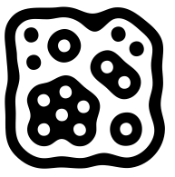
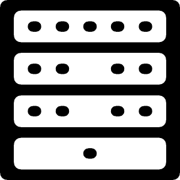

.. include:: ../js.rst

.. _markers:

#########################
Fiducial Marker Detection
#########################

.. image:: /icons/185px/markers.png

The ICLMarkers package provides a general interfaces for most
different types of fiducial marker detection methods. The essential
classes of this package are :icl:`markers::FiducialDetector` and
:icl:`markers::Fiducial`.  

The :icl:`FiducialDetector` implements a plugin-based system that can
be configured at instantiation time in order to use a certain marker
detection backend. Dependent on the selected backend, the detected
markers (of type :icl:`Fiducial`) provide a different set of
information -- some can only provide 2D information, others do also
provide 3D pose information. Also dependent on the chosen plugin type,
markers have to be loaded in a certain way that is also generalized by
the single method :icl:`FiducialDetector::loadMarkers`.

Table of Contents
^^^^^^^^^^^^^^^^^

* :ref:`markers.supported`
 
  * :ref:`markers.supported.art`
  * :ref:`markers.supported.bch`
  * :ref:`markers.supported.amoeba`
  * :ref:`markers.supported.icl1`

* :ref:`markers.example`

* :ref:`markers.creating-markers`

* :ref:`markers.benchmarks`

.. _markers.supported:

Supported Marker Types
^^^^^^^^^^^^^^^^^^^^^^

The marker detection frameworks supports tracking of a set of common
fiducial marker types. Due to the generic marker detection interface
:icl:`FiducialDetectorPlugin` we are able to add further marker
detection backends in the future.

.. _markers.supported.art:

ARToolkit Markers ("art")
"""""""""""""""""""""""""

.. image:: images/art-marker.jpg
   :scale: 65%
   :alt: shadow

One of the first freely available marker detection library is the
`ARToolKit`_. The original framework was mainly developed as toolkit
for augmented reality applications. However the whole framework is
usually difficult to combine with other image processing libraries. In
particular its default version does not support to pass external image
data. 

The marker detection is based on finding quadrangular black image
regions, whose corners a detected. The marker center is then simply
rectified and matched against a set of loaded marker center images
using normalized cross-correlation of other distance
metrics. Basically arbitrary gray-scale images can be used as possible
marker centers, however, the matching of the central pattern is
usually very slow and not very robust.

.. _ARToolKit: http://www.hitl.washington.edu/artoolkit

.. _markers.supported.bch:

BCH Markers ("bch")
"""""""""""""""""""

.. image:: images/bch-marker.png
   :scale: 35%
   :alt: shadow

These fiducial markers are probably the best available so far. The
idea of using a self-error-correcting 2D binary BCH-coded pattern for
encoding marker IDs was originally introduced with the unluckily no
longer available **ARTag** library. A later fork of the ARToolkit
library called ARToolkit+, now known as `Studierstube Tracker`_
implemented the same algorithm again, however ARToolkit+ was in our
opinion still difficult to use and to integrate with, not only due to
a remaining internal dependency to the ARToolkit library.

Our implementation of the BCH-code marker detection plugin uses the
same pre-processing as the ARToolkit plugin for the detection of
quadrangular black image regions. However, in contrast to the
ARToolKit plugin, the extraction of the marker's ID is completely
different. Here, the marker's center is rectified, and binarized into
a 6 by 6 binary pattern, that is reinterpreted as BCH binary code and
matched against all registered BCH patterns in four rotations. In this
step, the BCH-coding module can automatically correct up to 3 bit
errors while the false positive ratio remains extremely low.

BCH marker detection is very fast and accurate with very low false
positive rate. Usually, this is the best choice.

.. _Studierstube Tracker:
   http://studierstube.icg.tugraz.at/handheld_ar/stbtracker.php

.. _markers.supported.amoeba:

Hierarchical ("Amoeba") Markers
^^^^^^^^^^^^^^^^^^^^^^^^^^^^^^^

The amoeba style hierarchical markers provided by the `reactivision`_
software. Amoeba fiducial markers cannot be detected in 3D. They do
only provide 2D center and rotation and the 2D boundary. However,
their detection is very fast and robust, as long as each marker region
is not smaller than a pixel. Actually, the original "amoeba" markers
must not be used with other marker detection libraries. However, since
the actual marker detection and ID encoding is just performed on the
basis of the markers hierarchical region structure (in the example
image, a black region, surrounding a white region containing 4 black
regions with no sub-regions, 2 black regions with one sub-region, one
black region with two sub-regions and one black regions with six sub
regions). Whenever the detection system detects such a region
structure in the binarized image's region graph, it will be detected
and identified as this marker. For the original "amoeba"-markers, a
genetic algorithm was used to minimize the marker size while
preserving a given optimal region-width. The region structure is
implemented and explained with the :icl:`TwoLevelRegionStructure`
class.

.. _reactivision: http://reactivision.sourceforge.net/

.. _markers.supported.icl1:

Special Markers of Type ("icl1")
^^^^^^^^^^^^^^^^^^^^^^^^^^^^^^^^

Originally these markers were developed for tracking the deformation
of a sheet of paper in real time [#f1]_ The markers consist of 4
vertical sections. Each of these sections contains a number of
*dot-regions*. Therefore, the marker detection method is comparable to
other hierarchical markers such as "amoeba", however, the well defined
marker structure allows for the systematic identification of every
single marker region, which provides better 3D pose-estimation
results.

.. [#f1] http://pub.uni-bielefeld.de/publication/2281366

.. _markers.example:

An Easy Example
^^^^^^^^^^^^^^^
.. literalinclude:: examples/markers.cpp
   :linenos:
   :language: c++
   :emphasize-lines: 9,23           

.. _markers.creating-markers:

Creating Marker Images
^^^^^^^^^^^^^^^^^^^^^^

We also provide an easy to use application that allows for the
creation of marker images. **icl-create-marker** is able to create
marker images for "bch", "art" and "icl1" markers. The original
"amoeba" markers are not free and cannot be published as part of the
library. For "bch" markers, the *icl-create-marker** application ca be
set up to use a certain *border width*, which is given in units of the
6 by 6 bch pattern in the center of the marker. The default value of 2
mean, that the whole marker consists of 10 by 10 cells, where the
outer two cells are the marker border and the inner 6 by 6 cells carry
the markers bch binary pattern. Even though for certain cases or a
given set of markers, this can be adapted, we strongly recommend to
use the default setting which provides the best compromise between
detectability and marker size. While for "bch" type markers, a given
integer id (in range [0,4095]) is sufficient, for "art" markers, a
center image must be provided (as a file-name). Here, the markers
border width is given as a real valued *border ratio* which defines
the ratio between border and center image pixels. For the detection is
is very important that the used :icl:`FiducialDetector` instance is
set up with the correct values for *border ratio* (and *border width*
in case of using "bch" markers). Creating a set of 10 bch markers
could e.g. be realized via command line in the **bash**::

  for (( i=0 ; $i<10 ; i++ )) ; do icl-create-marker -i bch $i -o bch$i.png ; done

.. _markers.benchmarks:

Benchmarks
^^^^^^^^^^

The benchmarks were applied on 1000x1000 images of type
:icl:`core::Img8u` showing regular grid or markers. Between the
markers, a single pixel line of white pixels was added, so the actual
image size was exactly 1020x1020 (in case of 50x50 pixel marker size)
and 1010x1010 (in case of 100x100 pixel marker size) pixels. The
benchmark system was a Core 2 Duo 2.4GHz, 4GB RAM, Ubuntu 12.04
32bit. For BCH Markers, we used different marker sizes of 50x50 and
100x100 pixels. For all other marker types, only 100x100 pixel markers
were used. The hierarchical methods ("icl1" and "amoeba") should be
independent from the marker size, because their identification
algorithms runs on the image's region graph rather than on its
pixels. We did not run tests on the "amoeba"-style markers, because
these mare are difficult to generate and their detection speed should
be very similar to the "icl1"-type markers. For the ARToolKit
markers, an unrealistic count of 100 reference markers (much more that
it could realistically distinguish) were loaded, and it is worth mention
that the "art" marker detector did usually not find and identify all
marker correctly.

+------------------+---------+---------+-----------+
| Markers/Plugin   |  "bch"  | "icl1"  |   "art"   |
+==================+=========+=========+===========+
| 400 (50x50 px)   |  50ms   |         |           |
+------------------+---------+---------+-----------+
| 144 (50x50 px)   |  22ms   |         |           |
+------------------+---------+---------+-----------+
|  64 (50x50 px)   |  13ms   |         |           |
+------------------+---------+---------+-----------+
|  16 (50x50 px)   |   7ms   |         |           |
+------------------+---------+---------+-----------+
| 100 (100x100 px) |  23ms   |   20ms  |   56ms    |
+------------------+---------+---------+-----------+
|  36 (100x100 px) |  13ms   |   10ms  |   25ms    |
+------------------+---------+---------+-----------+
|  16 (100x100 px) |   8ms   |    7ms  |   14ms    |
+------------------+---------+---------+-----------+
|   4 (100x100 px) |   6ms   |    5ms  |   10ms    |
+------------------+---------+---------+-----------+

The results demonstrate the outstanding performance of the detection
system. With a realistically visible 64 of size 50x50 pixels, the
theoretical framerate is about 76Hz. A single Fire-Wire 800 bus
reaches a maximum theoretical framerate of 63Hz at this image size
(1020x1020).

.. note::

   The whole detection system runs single-threaded and is mainly
   limited by the connected component analysis of the binarized image.

.. BCH 1020x1020, 400 markers (50x50 each) 49.4ms
   BCH 1020x1020, 144 markers (50x50 each) 22.3ms
   BCH 1020x1020, 64 markers (50x50 each) 13.0ms
   BCH 1020x1020, 16 markers (50x50 each) 7ms
   BCH 1010x1010, 100, (100x100 each) 23ms   (icl1 20ms) (art 56ms)
   BCH 1010x1010, 36, (100x100 each) 12.7ms  (icl1 10.3ms) (art 25 ms)
   BCH 1010x1010, 16, (100x100 each) 8.5ms  (icl1 7.1ms) (art 14ms)
   BCH 1010x1010, 4, (100x100 each) 6.5ms   (icl1 5.1ms) (art 10ms)

 
